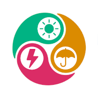
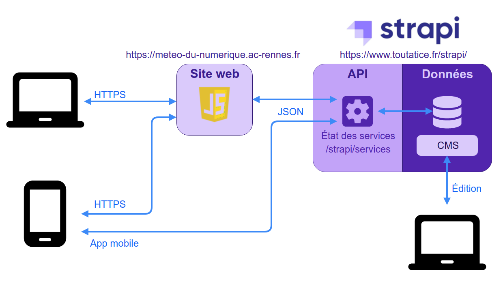

# La météo du numérique

Ce projet a été initié par l'académie de Rennes et vise à répondre aux besoins suivants :
* disposer d'un outil pour informer en temps réel nos usagers sur l'état de nos services,
* disposer d'un outil simple, dissocier du SI pour pouvoir communiquer quelque soient les pannes,
* réduire le nombre de tickets auprès de la plateforme d'assistance.

## Principe général
Le produit comprend deux développements (web javascript et mobile React Native) clients d'un Headless CMS léger Strapi.

Vous trouverez sur ce repository un répertoire pour chaque brique du produit :
* strapi : les adaptations faites sur strapi
* web : la partie javascript pour les accès web
* mobile : le développement mobile androïd
